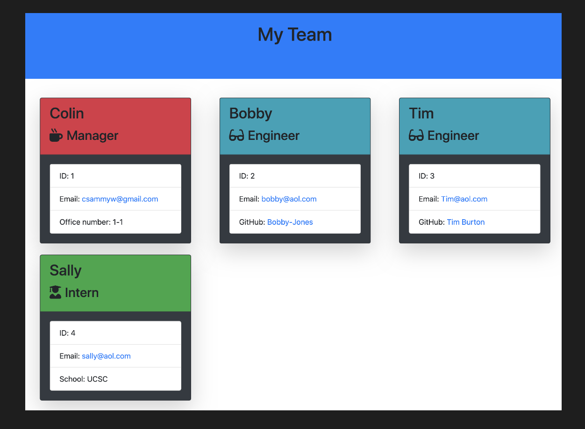
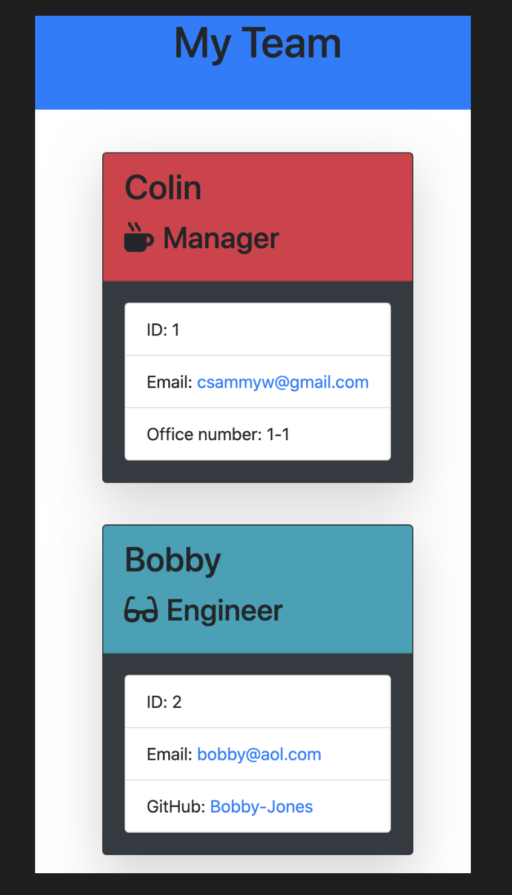

# Employee Summary Creator

### [GitHub](https://github.com/Colin-Whitcomb) Repository Link

 

 Final Product Preview
 

    

    
## Summary & Process
For this project, our objective was to create an app that dynamically generates a team summary with Node.js commands.

I began by drafting all of the constructor classes. Afterwards, I created the framework of inquirer prompts to ensure that all pertinent questions were asked. Once the functionality was complete, I took the liberty to add some Bootstrap styling which included adding responsive column sizes and background colors.
_______
## Table of Contents

* [Technologies Used](#technologies_used)

* [Contact](#contact)

## Generated Page - Screen Shots 
Desktop 

    

Responsive Small Screen

    

 

## Technologies_Used

- Node.js / Javascript / ES6
- NPM / Inquirer
- Bootstrap 
- HTML 
- Visual Studio Code
- Git / GitHub / GitPage

## Contact

* [Colin Whitcomb](https://github.com/Colin-Whitcomb)
* [LinkedIn](https://www.linkedin.com/in/colin-whitcomb-b808301a6/)
* [Portfolio](https://colin-whitcomb.github.io/Portfolio/)
